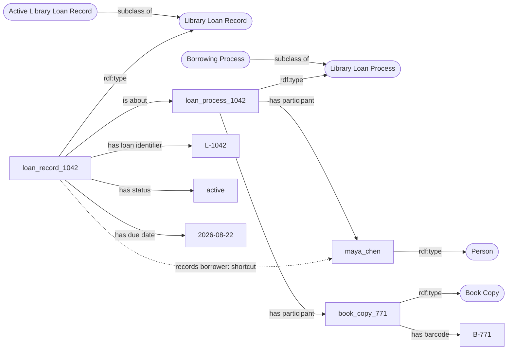

# Small Worked Example: A Library Loan Record

## Purpose

This example demonstrates the Day 2 workflow on a domain unrelated to the assigned cases. It shows how to move from a source row, to a design pattern, to an OWL encoding in Protégé.

The example is intentionally small. It illustrates the method without prescribing a single modeling solution for the Day 2 exercises.

---

## 1. Source Data

Suppose a library system contains the following row:

| Column | Value |
|---|---|
| `loan_id` | `L-1042` |
| `borrower_name` | `Maya Chen` |
| `item_barcode` | `B-771` |
| `checkout_date` | `2026-08-01` |
| `due_date` | `2026-08-22` |
| `status` | `active` |

The row is not itself a person, book, or loan process. It is a source record containing information about a particular library loan.

---

## 2. Entity Inventory

| Source term or value | Proposed representation | Kind | Rationale |
|---|---|---|---|
| The source row | `loan_record_1042` | Individual | One particular information record |
| `L-1042` | `"L-1042"` | Literal | A source identifier, not a class |
| Maya Chen | `maya_chen` | Individual | One particular person |
| `B-771` | `"B-771"` | Literal | A barcode value |
| The physical item | `book_copy_771` | Individual | One particular material copy |
| The borrowing activity | `loan_process_1042` | Individual | One particular process |
| `2026-08-22` | `"2026-08-22"^^xsd:date` | Literal | A date value |
| `active` | `"active"` | Literal | A source status value |

---

## 3. Reusable Design Pattern

### Classes

- `Library Loan Record`
- `Active Library Loan Record`
- `Library Loan Process`
- `Borrowing Process`
- `Person`
- `Book Copy`

### Relations

- `is about`
- `has participant`
- `has loan identifier`
- `has barcode`
- `has checkout date`
- `has due date`
- `has status`

### Pattern Reading

Read the class-level pattern as follows:

- Every `Library Loan Record` is about some `Library Loan Process`.
- Every `Library Loan Process` has some `Person` as a participant.
- Every `Library Loan Process` has some `Book Copy` as a participant.
- An `Active Library Loan Record` is a `Library Loan Record` whose status value is `"active"`.
- A `Borrowing Process` is a `Library Loan Process` that has both a person and a book copy as participants.

The last two axioms allow the reasoner to classify individuals from asserted facts.

---

## 4. Diagram

### Legend

- Rounded rectangle: class
- Rectangle: individual
- Quoted text: literal
- Solid arrow: direct relation
- Dashed arrow: optional shortcut



The dashed `records borrower` relation is a shortcut. Its intended path is:

```text
Library Loan Record
    is about some Library Loan Process
    has participant some Person
```

The shortcut is not required for the core model. If included, document whether it is asserted directly or produced by a rule outside OWL DL.

---

## 5. Protégé Encoding

The exact IRIs and imported upper-level classes will depend on the starter ontology. The following Manchester syntax shows the intended logical structure.

### Class axioms

```text
Class: LibraryLoanRecord
  SubClassOf:
    InformationContentEntity,
    is_about some LibraryLoanProcess

Class: LibraryLoanProcess
  SubClassOf:
    Process,
    has_participant some Person,
    has_participant some BookCopy

Class: ActiveLibraryLoanRecord
  EquivalentTo:
    LibraryLoanRecord
    and has_status value "active"

Class: BorrowingProcess
  EquivalentTo:
    LibraryLoanProcess
    and has_participant some Person
    and has_participant some BookCopy

Class: BookCopy
  SubClassOf:
    MaterialEntity
```

### Data properties

```text
DataProperty: has_loan_identifier
  Domain: LibraryLoanRecord
  Range: xsd:string

DataProperty: has_barcode
  Domain: BookCopy
  Range: xsd:string

DataProperty: has_checkout_date
  Domain: LibraryLoanRecord
  Range: xsd:date

DataProperty: has_due_date
  Domain: LibraryLoanRecord
  Range: xsd:date

DataProperty: has_status
  Domain: LibraryLoanRecord
  Range: xsd:string
```

### Individuals

```text
Individual: loan_record_1042
  Types:
    LibraryLoanRecord
  Facts:
    is_about loan_process_1042,
    has_loan_identifier "L-1042",
    has_checkout_date "2026-08-01"^^xsd:date,
    has_due_date "2026-08-22"^^xsd:date,
    has_status "active"

Individual: loan_process_1042
  Types:
    LibraryLoanProcess
  Facts:
    has_participant maya_chen,
    has_participant book_copy_771

Individual: maya_chen
  Types:
    Person

Individual: book_copy_771
  Types:
    BookCopy
  Facts:
    has_barcode "B-771"
```

---

## 6. Run the Reasoner

Start HermiT and inspect the inferred types.

Expected results:

- `loan_record_1042` is inferred to be an `Active Library Loan Record`.
- `loan_process_1042` is inferred to be a `Borrowing Process`.
- The ontology remains consistent.

If either inference is missing, check:

- whether the literal is exactly `"active"`;
- whether both participants are asserted;
- whether the equivalent-class axioms were entered correctly; and
- whether the reasoner has been synchronized after the latest edits.

---

## 7. What This Example Demonstrates

This model keeps separate:

- the source record;
- the process the record is about;
- the person participating in the process;
- the physical book copy;
- source identifiers;
- dates; and
- a status value.

It also illustrates the difference between:

- asserted types and inferred types;
- direct relations and shortcut relations;
- individuals and literals; and
- necessary conditions and necessary-and-sufficient definitions.

---

## 8. Common Mistakes

Avoid the following:

- Modeling `L-1042` as a class.
- Modeling Maya Chen as a string when the person must participate in a process.
- Treating the source row as the loan process itself.
- Treating the barcode as the physical book copy.
- Using `rdfs:label` to represent status, due date, or identifier values.
- Expecting the reasoner to infer `Active Library Loan Record` without an equivalent-class definition.
- Adding the shortcut relation without documenting the longer path it abbreviates.
