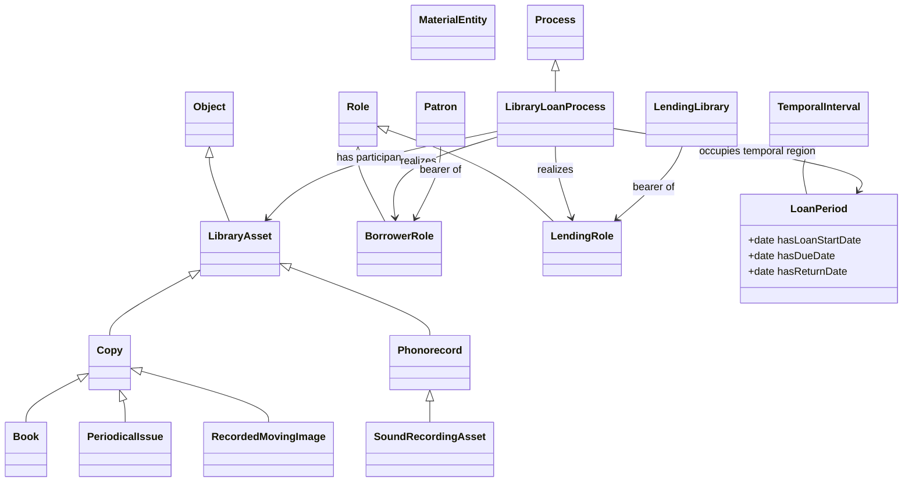

second-ever prompt submitted to claude. the prior was a test run wherein i asked for an extension of bfo to describe a writing pen. prompt for the purpose of this exercise follows:

```
great work, that passes reasoner checks. let's build another bfo-compliant extension just like that.

a library-loan process is the domain to be represented;
the purpose of the ontology is to model the library loan process of an asset like book, cd, movie, magazine, etc;
We want this to answer questions like "how many movies were loaned on tuesdays this year?"
the desired serialization is Turtle;
definitions should be included, using legal terms or other authoritative sources.
no named individuals should be included;
BFO is the only upper ontology, reused terminology, and modeling constraints we want the model to follow. ```

Results stored as generated-ontology.ttl and sketched, also by Claude, here:



#errors#

Prompt error: I chose not to specify any instances/specifics or any classes, allowing the bot to select them based on context. We therefore can check out from the library only Books, periodicals, movies, and phonorecords. 

My constraint to use legally authoritative definitions definitely earned me the "phonorecord" class. I shall send a strongly-worded telegram about this slight.

category error: "loan period" shot itself into space.

definition error: well i was going to say the "copy" and "phonorecord" parent classes were wrong, but actually i didn't know those were actual categories defined in the us copyright act. they're unintuitive though, and frankly at this point i'd call upon a librarian to sort this out, because law does not describe or prescribe reality. 

logical/OWL modeling error: it assigns the role of lender to the library, not to a librarian (person bearing role) - but this is represented only in definitions.

it did not account for my one and only DSQ, such that no 

reasoner: passes! impressive. the file's still garbage.

##Corrections:##

put the loan period class into a 1d temporal period.

choosing to leave the questionable asset configuration as-is, added a few classes.

added alt labels to the role names, lender/lending, borrower/borrowing

##Notables:##
It made a reasonable disjoint among lendable assets that excludes photorecords from copy

##Evaluate Classes, Relations, and Axioms##
Classes
Ask:

Is each class a repeatable type of entity?
Yes
Are sibling classes distinguished clearly?
Yes, surprisingly
Are subclass axioms justified, e.g. for A subclass of B, is every instance of A an instance of B?
Yes
Relations
Ask:

Does each relation have a clear meaning?
Yes, i think
Are domain and range axioms justified?
There are few
Are vague relations such as related_to, has_data, or involves doing too much work?
Does the relation connect entities of the appropriate kinds?
Individuals and Literal Values
Ask:

Are named individuals truly particular entities?
Has the model created individuals merely to represent labels or values?
Are source-specific assertions being treated as universal truths?
